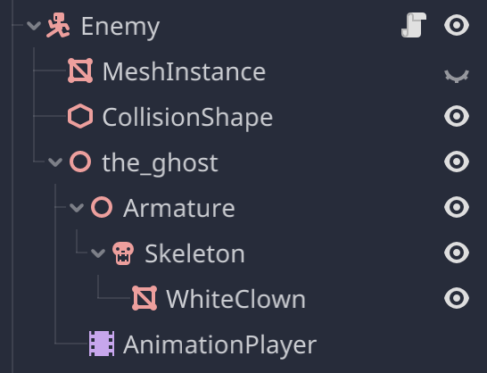
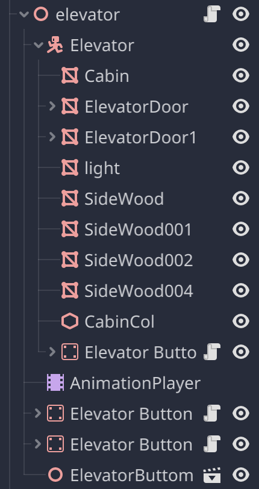

# The Haunted Hotel Game Design Document

## Goal
Create a project that is a 3d FPS game about exploring a hunted hotel.

## Overview
The project is a 3d FPS game of a short story. It comes with detialed environment, decent interation experience. The game environment is mostly made with Blender 3.5, while the game mechanism is developed with Godot game engine.

## Game Description
The game was imspired by Alberto Navarro's The Death Trip. It will be a 3d first person shooter game where the player explores a haunted hotel. The protagonist's car broke down and he has to live here for one night, yet he soon found something terribly wrong with the place. The player will be able to explore the hotel and find clues to the mystery of the hotel and be able to find weapons and use them to fight off the ghosts that are haunting the hotel. 
The player will be able to control the character with the keyboard and mouse and move around the level map. He will be able to interact with objects in the map. The game also allows operation of weapons. To cooperate with this part, the game has bullet physics and dynamics and an ammo system. The weapon has realisitc animation and sound effect. The enemy will move toward the player with realisitc animation and the player will use the weapon to cause damage to the enemy or use the environment to beat him.

## Game Assets
### The Map
The map contrains the hotel and some simplified architectures around it. 

### Player
Simplified player model. As the game is a first person shooter game, the player base mesh is a capsule shaped mesh. The player does not have animation. The player has a neck node attached, which provided a base for the camera and weapon.
#### Camera
The camera is attached to the player's neck node, rotating with player's mouse input. On the horizontal direction, the camera's rotation changes player's direction of movement. 
#### Weapon
The weapon is a low-poly shotgun model with animation. It is disabled (invisible, ignores player input) until the player interacts with another interactable weapon model on the ground. 

### Enemy
The enemy is a ghost model with animation. It is invisible and unmoving until the player interacts with the interactable weapon model on the ground.

### Flowers and flowerstands
The flowers and flowerstands are regidbody models. They are used to decorate the map and assist player in beating the enemy.

### Elevator
The elevator is a low-poly model with animation. It is used to move the player between floors.

## UI
### Main Menu
The main menu only has two buttons, one for starting the game and one for exiting the game. The main menu has a 2d splash screen as the background image. The buttons are simple buttons with text and a background texture. The buttons are connected to the game's main scene and the exit function.

### In game UI
When player interacts with items, there are message prompts that tells them what the interactable does. The message prompt is a 2d label. The message prompt is a child node attached to the player's camera and always stays in rotation with the camera.

### Game Over
When the player dies, the game over screen will appear. The game over screen is a 2d label of a image I made, which is a blurred image of a red-lighted corridor in the hotel with the ghost in it with a message saying "You Died" in the front.

### Game Complete
WHen the player finishes the gameplay, this screen will be shown to the player. The screen is a 2d label with only two words "You Survived".

## Game Object Mechanism
### Player Mechanism
Player node's tree structure added after completion:

As shown in the graph, the player is a kinematic body with a script. It has two child nodes to build its physical properties: one meshInstance and one collisionShape. The player has a node which the camera and the weapon is attached to connected to the top of the kinematic body. Player's spatial translation is controlled by the WASD keys. Player's direction of movement follows the horizontal rotation of the camera. The player can also sprint, by pressing and holding the shift key in movement.

#### Camera Mechanism
The camera is connected to the viewpoint of the game. When user clicks on the window of the game, the game will start capturing mouse motion. The camera will rotate according to the mouse movement and allow the player to explore the environment around. The camera's horisontal rotation define the direction of the player's movement. The vertical rotation of the camera is limited to prevent the player from looking up or down too much.
#### Weapon Mechanism
As the child of the camera, the rotation of the weapon follows the camera, so does the direction of bullet spawn. The mouse right key is used to aim (by moving the weapon to the center of the camera scene) and the right mouse button is used to fire (spawn a bullet), whethered aimed or blind shoot. 

### Enemy Mechanism
Enemy node's tree structure added after completion:

The enemy is a kinematic body with a script. Just like the player, It has a meshInstance and a collisionShape to achieve its physical properties. The enemy takes the shape of a clown, which is a model imported from mixamo.com. When the game is initialized, it is invisible and unmoving in one end of the building's corridor. When the player interacts and picks up the weapon, the enemy is set to visible and starts moving toward the location of the player's side of the corridor with a running animation. The enemy will stop moving when it reaches the player's side of the corridor if there is no collision alone the way. Enemy will stop moving and play a tripped-over animation if it collides with a specific class of object (Eg, Flower and flowerstand).

#### Flower and Flowerstand Mechanism
The flower and flowerstand are rigidbody models. They are static bodies with meshInstances and collisionShapes. When the spawned bullets collided with them, they will reacts in a physicial manner (fall apart).When the enemy collides with the flower or its stand that fell on its way, the enemy will stop. The flower will be bumped when it collides with the enemy.

### The Elevator Mechanism

The elevator is a kinematic mesh with a script. It has two child nodes to build its physical properties: multiple meshInstances and collisionShapes. The elevator is a kinematic body. When the player interacts with the elevator, the elevator will open or close its door as well as move up and down.

## States and Transitions
WHen the user enters the game, he will spawn in a hotel lobby. The player is able to move around the lobby and interact with the elevator. When the player interacts with the elevator, the elevator will open its door and the player can enter the elevator. The player may enter the elevator interact with its buttons inside, and the elevator will close its door and move up. When the elevator reaches the top floor, it will open its door and the player can exit the elevator. When the player exits the elevator, he will be in the corridor of the top floor. The player can move around the corridor and interact with the weapon on teh ground. When the player interacts with the weapon, the weapon will be available, and the enemy will appear and start moving toward the player. When the enemy reaches the player, the player loses. However the player can use the weapon to take down the flowers and stands to trip the the enemy over. When the enemy is killed, the player can interact with the elevator and move to the first floor. When the player reaches the door again, the game is over and the player.

## Milestone Plan
### Simplified models
In the beginning, I will use simple models to build the game. The player will be a capsule shaped mesh. The enemy will be a cube. The weapon will be a elongated cube mesh. The flowers and flowerstands will be simple cubes. The elevator will be a simple box. The map will be two planes. 

### Player movement
The movement mechanism ensures the game to be basically playable: 
- The player will be able to move around the map with WASD keys. 
- The player will be able to sprint by holding the shift key. 
- The player will be able to look around with the mouse. 
- The player will be able to aim and shoot with the mouse.

### Basic Animations
The elevator animations and he enemy's basic move-and-slide is added to test the interactions. Weapon's firing and loading animation and firing sound player are added along the way, too.

### THe weapon's firing mechanism
Set up the spawning and initial motion of the bullet. The bullet will be spawned at the muzzle of the weapon and move in the direction of the weapon barrel. The bullet will be destroyed after a amount of time or fell too far.

### The map
This should be some of the last items to be detailed. The entire hotel map, surrounding environment and all indoor decorations need to be added. The map will be a 3d model created in blender, with some of the models from BlenderKit and other model providers. This part is the most time consuming part of the project. 

### Migration of game object into godot
The models will be imported into godot and set up as game objects. This step is also time consuming. There are multiple materials not compatible with GLES used by godot. There are meshes that does not have a collision shape which needs to be added manually. There are also some animations that loses its original organization. All animations needs to be re-calibrated.

### Debugging and Detialing
The last phrase intend to make the environment more immersive and the game experience more smooth and enjoyable (For instance, add more sound effect, animations, lighting, etc.)