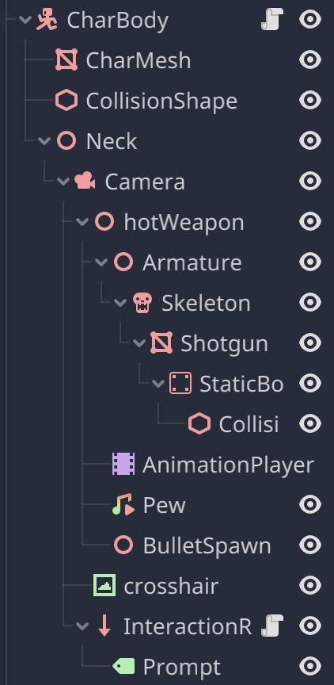

# The Haunted Hotel Game Design Document

## Goal
Create a project that is a 3d FPS game about exploring a hunted hotel.

## Overview
The project is a 3d FPS game of a short story. It comes with detialed environment, decent interation experience. The game environment is mostly made with Blender 3.5, while the game mechanism is developed with Godot game engine.

## Game Description
The game was imspired by Alberto Navarro's The Death Trip. It will be a 3d first person shooter game where the player explores a haunted hotel. The protagonist's car broke down and he has to live here for one night, yet he soon found something terribly wrong with the place. The player will be able to explore the hotel and find clues to the mystery of the hotel and be able to find weapons and use them to fight off the ghosts that are haunting the hotel. 
The player will be able to control the character with the keyboard and mouse and move around the level map. He will be able to interact with objects in the map. The game also allows operation of weapons. To cooperate with this part, the game has bullet physics and dynamics and an ammo system. The weapon has realisitc animation and sound effect. The enemy will move toward the player with realisitc animation and the player will use the weapon to cause damage to the enemy or use the environment to beat him.

## Game Assets
### The Map
The map contrains the hotel and some simplified architectures around it. 

### Player
Simplified player model. As the game is a first person shooter game, the player base mesh is a capsule shaped mesh. The player does not have animation. The player has a neck node attached, which provided a base for:

#### Camera
The camera is attached to the player's neck node, rotating with player's mouse input. On the horizontal direction, the camera's rotation changes player's direction of movement. 
#### Weapon
The weapon is a low-poly shotgun model with animation. It is disabled (invisible, ignores player input) until the player interacts with another interactable weapon model on the ground. 

### Enemy
The enemy is a ghost model with animation. It is invisible and unmoving until the player interacts with the interactable weapon model on the ground.

### Flowers and flowerstands
The flowers and flowerstands are regidbody models. They are used to decorate the map and assist player in beating the enemy.

## UI
### Main Menu
The main menu only has two buttons, one for starting the game and one for exiting the game. The main menu has a 2d splash screen as the background image. The buttons are simple buttons with text and a background texture. The buttons are connected to the game's main scene and the exit function.

### In game UI
When player interacts with items, there are message prompts that tells them what the interactable does. The message prompt is a 2d label. The message prompt is a child node attached to the player's camera and always stays in rotation with the camera.

### Game Over
When the player dies, the game over screen will appear. The game over screen is a 2d label of a image I made, which is a blurred image of a red-lighted corridor in the hotel with the ghost in it with a message saying "You Died" in the front.

### Game Complete
WHen the player finishes the gameplay, this screen will be shown to the player. The screen is a 2d label with only two words "You Survived".

## Game Object Mechanism
### Player Mechanism
Player node's tree structure:

